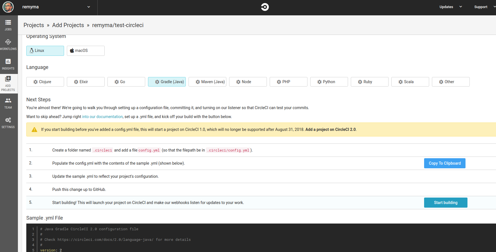
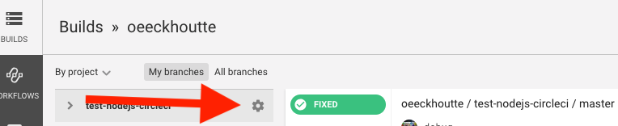
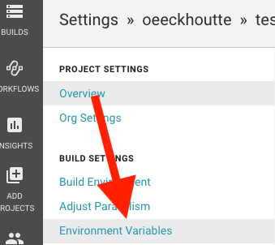

# Build a CI/CD pipeline for a Java application using imageStream

In this workshop, we will deploy a java application to Manawa platform with CI/CD using CircleCI.
The application code will be hosted in a Github repository.

So here are the services involved fro this worshop :
* SCM             : github (https://github.com)
* CICD platform   : CircleCI (https://circleci.com)
* Docker registry : Manawa docker registry (https://registry-console-default.apps.manawa.dev.adeo.cloud)
* PAAS            : Manawa (https://master.manawa.dev.adeo.cloud/console/)

## Prerequisites

* Git installed on your laptop
* A Github account

## Step 1 : Init your Github repo
1. Create a new `hello-world-java` repo on your github account
2. Copy our sample `hello-world` application from `java/step1` directory and paste it somewhere on your filesystem. Then init and push your git repo :

```shell
cp -r java/step1/hello-world <path>
cd <path>/hello-world
git init
git add pom.xml src/ .gitignore
git commit -m "first commit"
git remote add origin https://github.com/<your_username>/hello-world-java.git
git push origin master
```

## Step 2 : Continuous Integration

In this section we are going to build your application using CircleCI and execute some unit tests.

* Add the sample circleci configuration provided in `step2` directory.
* Push CircleCI configuration to github

```shell
cp -r java/step2/.circleci <path>/hello-world
cd <path>/hello-world
git add .circleci
git commit -m "Add CircleCI configuration"
git push origin master
```

The CircleCI yaml file is needed by CircleCI to identify your project as importable. This config describe the pipeline steps that will be executed during the job.


To configure circleci to build your github projet :

* Create your CircleCI account
* Setup your project


* Build your project. As your project contains a valid `.circleci/config.yml` you can directly click on the 'start building' button :



* You should see an output similar to this :


This job will pull the sources from GitHub and install it as a maven project using docker openjdk-8 image according to the yaml configuration embedded in your project :

```yaml
version: 2
jobs:
  build:    
    working_directory: ~/repo

    docker:
      - image: circleci/openjdk:8-jdk-browsers

    steps:
      - checkout

      ...
      
      - run: mvn install
      
      ...
```


You now have a valid continuous integration pipeline that will build and deploy your code on Manawa each time you push an update to github.


## Step 3 : Continuous deployment

In this step we will complete the CircleCI configuration to trigger a deployment on manawa platform on each code change. Deployment consists on the following steps :
* Test and Build a new jar containing the code change (already done in step2)
* Build a docker image enclosing the modified jar
* create/update manawa project and configuration
* Push the image on manawa registry (the new image will trigger a redeploy on manawa)

### Docker

* Add `docker/Dockerfile` at the root of your project. Then push it to github.

```
cp java/step3/docker/Dockerfile <path>/hello-world
git add Dockerfile
git commit -m "Add dockerfile"
git push origin master
```

### CircleCI configuration

Now we are going to add a deployment step in your existing pipeline to deploy your application on Manawa each time an update is pushed to Github.
The deployment will execute the following steps :
* Init project in Manawa platform with a valid url
* Build docker image for your app
* Deploy your application in Manawa based on the previously built docker image

You can find the needed configuration files in `step3` directory

* You'll have to update your `.circleci` config with `step3/.circleci/config.yml`. This new configuration now contains 2 jobs :
** build job (nearly the same as in step2)
** deploy job (new) : the deploy job builds the docker image, push it in the docker registry and create/update the openshift project.
* (read the config.yml file in detail to check all the steps)
* The 2 jobs are linked by a CircleCI `workflow` definition :

```yaml
version: 2
jobs:
    build:
        ...
            
    deploy:        
        machine: true
            
        steps:
            - checkout
            ...           
            - run:
                name: Configure docker daemon
                ...

            - run:
                name: Install oc client
                ...
            
            - run:
                name: "Create Manawa project"
                ...

            - run:
                name: "Build and push docker image"
                ...
                    
            - run:
                name: "Sync Kubernetes objects"
                ...

            
workflows:
    version: 2
    build_and_deploy:
        jobs:
            - build
            - deploy:
                requires: 
                    - build

```

The new CircleCI workflow definition use some variables to parameter your build.

Here is the list of the needed variables :
> * PROJECT_NAME        --> Name of the project that will be created in Manawa. Should be unique in Manawa platform. Prefix it with `devweek-` and use your name in it, so that it is unique. Please note that your project name must consist of lower case alphanumeric characters or '-', and must start and end with an alphanumeric character (e.g. 'devweek-my-name',  or 'devweek-123-abc') 
> * CLUSTER_URL         --> https://manawa.euw1-gcp-poc.adeo.cloud/
> * CLUSTER_USERNAME    --> Your LDAP username
> * CLUSTER_PASSWORD    --> Your LDAP password
> * DOCKER_REGISTRY_URL --> docker-registry-default.euw1-gcp-poc.adeo.cloud

First, configure these vars in CircleCI :

* Click on your project settings button from the homepage :





The workflow definition also need the following files to be executed normaly :
* oc-create.sh shell script to automatically create your manawa project
* kubernetes yaml files : will be applied on manawa to create the deployment, service and route for your project

Copy these files in your project :

```
cp java/step3/oc-create.sh <path>/hello-world
cp -r java/step3/kubernetes <path>/hello-world
cd <path>/hello-world
git add kubernetes oc-create.sh
git commit -m "Kubernetes object definitions"
```

Then update your cicleci config :
```shell
cp -r java/step3/.circleci/config.yml <path>/hello-world/.circleci/
cd <path>/hello-world
git add .circleci
git commit -m "Add deployment step"
git push origin master
```
This should trigger a new build and deploy workflow.

### Test the Continuous Deployment

All our CI/CD workflow is now fully setuped. How do we check everithing is fine ?
Just push a code change and check that it is deployed.

* Edit the java src : `vim src/main/java/com/dockerforjavadevelopers/hello/HelloController.java`, l. 12 replace :
```java
return "Welcome to the devweek !\n";
```

by 
```java
return "Welcome to the devweek <your_username> !\n";
```

```shell
git commit -m "Update view HelloController to display my username"
git push origin master
```

Then check the that the steps run fine :
* A new worfklow should be triggered in CircleCI
* When the CircleCI workflow is ended, a new deployment is triggered in Manawa
* When the deployment in Manawa is finished, refresh your browser to visualize your changes !

