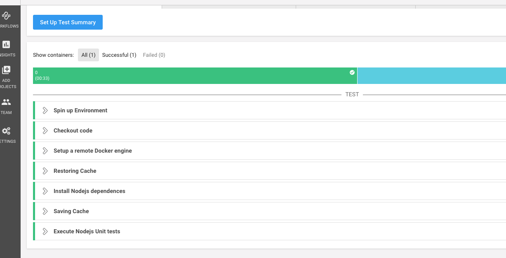
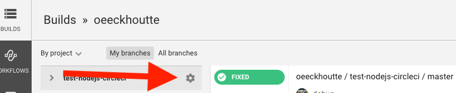
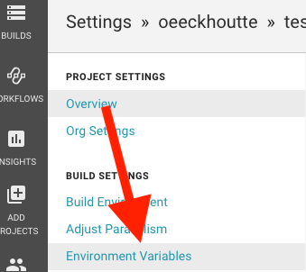
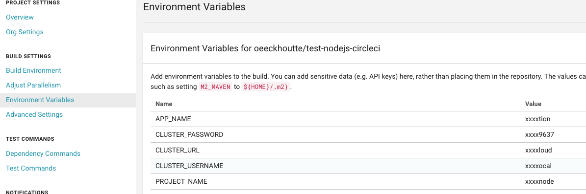

# Build a CI/CD pipeline for a NodeJS application using S2I

* SCM             : github (https://github.com)
* CICD platform   : CircleCI (https://circleci.com)
* Docker registry : Quay (https://quay.io/)
* PAAS            : https://master.manawa.dev.adeo.cloud/console/

## Step 1 : Init your Github repo
1. Create a new `hello-world-node` repo on your github account
2. Copy our sample `hello-world-node` application from `node/step1` directory and paste it somewhere on your filesystem. Then init and push your git repo :

```shell
cp -r node/step1/hello-world-node <path>
cd <path>/hello-world-node
git init
git add --all
git commit -m "initial commit"
git remote add origin https://github.com/<your_username>/hello-world-node.git
git push origin master
```

## Step 2 : Continuous Integration

In this section we are going to build your application using CircleCI and execute some unit tests.

* Add the sample circleci configuration provided in step2 directory.
* Push CircleCI configuration to github

```shell
cp -r node/step2/.circleci <path>/hello-world-node
cd <path>/hello-world-node
git add .circleci
git commit -m "Add CircleCI configuration"
git push origin master
```

The CircleCI yaml file is needed by CircleCI to identify your project as importable. This config describe the pipeline steps that will be executed during the job. To configure circleci to build your github projet :

* Create your CircleCI account
* Build your project
* You should see an output similar to this :




You now have a valid continuous integration pipeline that will build and deploy your code on Manawa each time you push an update to github.


## Step 3 : Continuous deployment

### Manawa build configuration 

* Create a project in Manawa and a Manawa build config

> Please name your project like this: devweek-<your_ldap>-hello-world-node (e.g. 'devweek-2000xxxx-hello-world-node) 

```
oc login -u <CLUSTER_USERNAME> -p <CLUSTER_PASSWORD> <CLUSTER_URL>
oc new-project <PROJECT_NAME> 
oc new-build --docker-image=bucharestgold/centos7-s2i-nodejs:latest --binary=true --name=hello-world-node
```

### CircleCI configuration

Now we are going to add a deployment step in your existing pipeline to deploy your application on Manawa each time an update is pushed to Github.

* Copy the file `.circleci/config.yml` and replace your existing file : `.circleci/config.yml`
* Configure CircleCI and add the environment variables needed by the CircleCI configuration file. 

*From the home page of CircleCI:*





> Set the following variables:
> * APP_NAME --> Name your application `node-openshift-ex`
> * PROJECT_NAME --> Like before name your project like this: devweek-<your_ldap>-hello-world-node
> * CLUSTER_URL
> * CLUSTER_USERNAME
> * CLUSTER_PASSWORD




* Push CircleCI configuration to github


```shell
git add .circleci/config.yml
git commit -m "Add deployment step"
git push origin master
```


### Manawa app creation 

* In the previous section (CircleCI Configuration) we pushed a CircleCI config file to Github. The **oc commands** included in the CircleCI config file allowed us to push our source code to Manawa. 
To deploy the application using the source code uploaded it is necessary to create an application.

```
oc new-app hello-world-node
```


### Test the Continuous Deployment

* Edit this file to 

```shell
git add .circleci/
git commit -m "Update CircleCI configuration to deploy on manawa"
git push origin master
```
* Edit the page : `views/index.html`, l. 219 replace :
```html
<h1>Welcome to your Node.js application on OpenShift</h1>
```

by 
```html
<h1>Welcome to <your_username> Node.js application on OpenShift</h1>
```

```shell
git commit -m "Update view index.html to display my username"
git push origin master
```